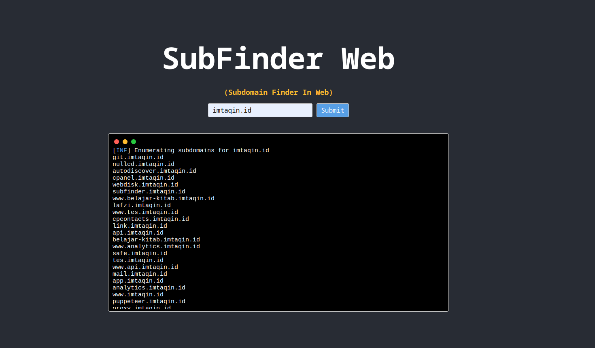

  

## About SubFinder Web



  

*SubFinder Web* is a web-based subdomain enumeration tool built using Node.js and the [node-pty](https://github.com/Tyriar/node-pty) library. It allows you to enter a subdomain and run the SubFinder command-line tool to enumerate subdomains on the server-side, and display the results in the browser using a terminal-like interface.

## Demo

[https://subfinder.imtaqin.id/](https://subfinder.imtaqin.id/)

## Installation

  

Before installing SubFinder-Web, make sure you have SubFinder installed on your system. You can download the latest version from the [official GitHub repository](https://github.com/projectdiscovery/subfinder).

  

To install and run SubFinder, follow these steps:

  

1. Clone the repository:

```bash
git clone https://github.com/tegal1337/SubFinder-Web.git
```

2. Install the dependencies:

  

```bash
cd SubFinder-Web
npm install
```

  

3. Run the application:

  
```
node app.js
```

This will start the Node.js application and make it available at [http://localhost:3000](http://localhost:3000/).

  

## Usage

  

To use SubFinder, simply enter a subdomain in the input field and click the "Submit" button. The application will run the SubFinder command-line tool and display the results in the browser using a terminal-like interface.

  
  
  

## Contributing

  

Contributions are welcome! If you find any bugs or have any feature requests, please open an issue on the [GitHub repository](https://github.com/tegal1337/SubFinder-Web) or submit a pull request.

  

## License

  

This project is licensed under the  GNU General Public License  . See the [LICENSE](/LICENSE) file for more information.

